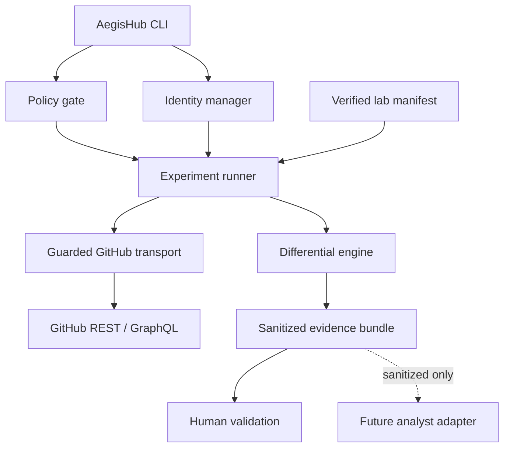
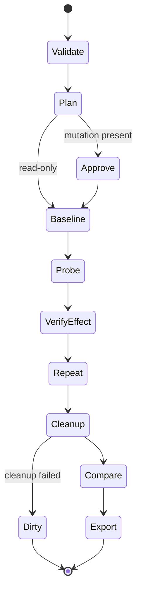

# AegisHub Bounty Mode — Phase 1 Foundation Design

**Status:** Approved design
**Approved by:** Llew
**Approval date:** 2026-08-13
**Target branch:** `codex/bounty-mode-foundation`
**Scope:** Phase 1 foundation only

## 1. Summary

AegisHub currently analyzes source repositories for exposed secrets and unsafe code patterns. That remains useful, but it is not sufficient for researching vulnerabilities in GitHub itself. GitHub's Bug Bounty program requires a concrete security boundary failure in an in-scope GitHub-owned product, supported by a reproducible proof of concept and demonstrated impact.

Bounty Mode will add a separate, safety-constrained research workbench to the existing monorepo. It will authenticate two accounts controlled by the researcher, verify a dedicated lab, run low-volume differential experiments as the lab owner, an external researcher, and an anonymous actor, and produce sanitized evidence bundles for human analysis and responsible disclosure.

Phase 1 does not attempt broad vulnerability discovery. It establishes the trustworthy execution, policy, identity, isolation, comparison, and evidence foundations required for later GitHub API, Actions, Apps, Packages, organization, and AI-assisted research.

## 2. Problem Statement

The existing AegisHub engine is a repository-focused static analyzer:

- The Rust core exposes an `Analyzer` trait.
- `SecretsAnalyzer` is the only fully implemented analyzer.
- The CLI can collect local or GitHub-hosted source files and invoke the Rust engine.
- The orchestrator and GitHub App packages are currently scaffolds.
- Findings are scored by fixed severity penalties.

This architecture detects issues inside repository content. GitHub's published ineligible list states that vulnerabilities in user repositories do not constitute vulnerabilities in GitHub.com. A valid GitHub Bug Bounty candidate instead needs evidence of a GitHub security boundary violation, such as unauthorized access, unauthorized modification, privilege escalation, or isolation failure.

The new system therefore needs to observe behavior across identities and permissions, not merely match code patterns. It must also be substantially safer than a generic web scanner: every active operation must be bounded to resources owned by the researcher, low-volume, reproducible, and auditable.

## 3. Design Principles

1. **Fail closed.** Unknown targets, operations, identities, resource IDs, or permissions are blocked.
2. **Owned resources only.** Active experiments can address only resources proven to belong to the configured lab.
3. **Evidence over speculation.** A response difference is an observation, not a vulnerability. A candidate requires repeatable evidence of a crossed boundary and concrete impact.
4. **Deterministic execution first.** AI may propose and analyze, but deterministic policy and runtime code remain authoritative.
5. **Human control for mutations.** Every experiment that changes GitHub state requires a one-run approval and a predeclared cleanup plan.
6. **Low volume by construction.** Concurrency, request budgets, mutation budgets, retries, and supported endpoints are restricted in code.
7. **No credential leakage.** Authentication material never appears in logs, reports, exceptions, fixtures, or AI inputs.
8. **Reproducibility.** Every retained observation is attributable to an actor, operation, experiment version, lab snapshot, and policy version.
9. **Preserve existing AegisHub behavior.** Bounty Mode is an additional workflow; the Rust static analyzer and existing `scan` command continue to work.
10. **No automatic disclosure.** AegisHub prepares evidence but never submits to HackerOne or publishes vulnerability details.

## 4. Goals

Phase 1 will provide:

- Device Flow authentication for `owner` and `researcher` identities.
- An unauthenticated `anonymous` actor.
- Identity verification that prevents one GitHub account from filling both authenticated roles.
- Session-only credential storage by default and optional operating-system keychain storage.
- A versioned lab manifest containing stable GitHub IDs, not only names.
- Proof-of-control markers for active lab repositories.
- A versioned GitHub Bug Bounty policy snapshot and policy freshness checks.
- A strict catalog of allowed REST and GraphQL operations.
- Low-volume request execution with budgets, stop conditions, and redaction.
- A declarative experiment format without shell commands, scripts, or arbitrary URLs.
- Differential execution and semantic comparison across actors.
- Cleanup tracking and dirty-lab blocking.
- Sanitized evidence bundles and Markdown reproduction reports.
- A CLI workflow suitable for Windows, WSL2, Linux, and Docker.
- A provider-neutral interface for later AI-assisted hypothesis generation.

## 5. Non-Goals

Phase 1 will not include:

- Scanning arbitrary GitHub users, organizations, repositories, packages, or infrastructure.
- Mass scanning, crawling, scraping, brute force, credential attacks, spam, DDoS, or volumetric testing.
- Tests against third-party data or repositories, even when they are public.
- Browser cookie capture, password handling, 2FA automation, session hijacking, or social engineering.
- Raw Burp Suite-style arbitrary request replay.
- Arbitrary shell execution or user-provided JavaScript in experiments.
- Autonomous exploit chains, persistence, destructive testing, or data exfiltration.
- Availability testing against GitHub production.
- Testing GitHub Mobile, Desktop, CLI binaries, Enterprise Server, Actions isolation, Packages, or organization privilege transitions. Those require later phase-specific specifications.
- Automatic severity assignment under GitHub's bounty guidelines.
- Automatic HackerOne submission or public disclosure.
- A built-in model provider. Phase 1 exports sanitized analysis packs and defines an adapter interface only.

## 6. High-Level Architecture



The current Rust core remains responsible for repository static analysis. Bounty Mode uses TypeScript for GitHub authentication, API schemas, orchestration, and evidence because the existing monorepo already uses TypeScript, Zod, Commander, and Octokit for those boundaries.

### 6.1 Package Boundaries

#### `packages/bounty-core`

A new pure TypeScript package with no network or credential access.

Responsibilities:

- Strict Zod contracts for policies, manifests, experiments, observations, diffs, candidates, and evidence metadata.
- Policy evaluation.
- Operation-catalog validation.
- Request and mutation budget accounting.
- Response normalization and semantic comparison.
- Candidate classification.
- Redaction and evidence serialization.
- `AnalystAdapter` input and output contracts.

This package must be deterministic and independently testable.

#### `packages/bounty-runtime`

A new TypeScript package containing controlled I/O.

Responsibilities:

- GitHub App Device Flow.
- Credential-vault implementations.
- Identity verification through GitHub's authenticated-user endpoint.
- Lab initialization and verification.
- Guarded REST and GraphQL transport.
- Experiment planning, execution, cleanup, repeat validation, and emergency stop.
- Atomic evidence-bundle writing.

All GitHub network requests originate here. Other packages cannot construct arbitrary GitHub requests.

#### `packages/cli`

The existing CLI gains a `bounty` command group. Its current `scan`, `report`, and `auth` behavior remains compatible.

The CLI performs interaction, confirmation, and presentation. It does not contain policy logic or direct GitHub HTTP calls.

#### `packages/dashboard`

No functional dashboard work is required in Phase 1. Contracts are designed so a later dashboard can display lab status, experiment plans, observations, evidence, and cleanup state without changing the stored formats.

#### Existing packages

- `packages/core`: unchanged except for unrelated compatibility fixes that become strictly necessary.
- `packages/orchestrator`: remains separate from the local Phase 1 runtime. A later phase may expose reviewed Bounty Mode runs through it.
- `packages/github-app`: does not become the research runtime. The researcher-owned GitHub App is an authentication and permission boundary, while the local runtime performs experiments.

## 7. Authentication and Identity Model

### 7.1 Actors

Every operation is attributed to exactly one actor:

- `owner`: the account that owns or administers the lab resources.
- `researcher`: the clean reserve account used to model an external or lower-privileged user.
- `anonymous`: an HTTP client without an authentication header.

The authenticated actors must have different immutable GitHub user IDs. Login names are recorded for display but never used as the sole identity check.

### 7.2 Device Flow

A researcher-owned GitHub App will use OAuth 2.0 Device Flow. AegisHub displays the short-lived user code and verification URL; the user authorizes the application in a normal GitHub browser session. AegisHub never receives a password, browser cookie, or 2FA code.

Configuration uses the GitHub App client ID. No client secret is required by Device Flow. User access and refresh tokens are returned directly to the local runtime.

### 7.3 Token Handling

- Tokens are stored in memory by default and disappear when the process ends.
- Optional persistence uses an implementation of `CredentialVault` backed by the operating-system keychain.
- If a supported keychain is unavailable, persistent login is disabled rather than falling back to plaintext.
- Tokens, refresh tokens, authorization headers, cookies, and device codes are never serialized to logs or evidence.
- Token refresh is permitted only through the authentication module.
- Logout deletes the selected vault record and invalidates the in-memory session.
- `bounty auth revoke-local` deletes all AegisHub credential records. GitHub-side revocation remains an explicit browser action, with a direct settings link shown to the user.

### 7.4 Permission Boundary

The GitHub App must be installed only on the dedicated lab account or organization and only on explicitly selected lab repositories when repository selection is available. The token's effective authority is the intersection of:

1. GitHub App permissions.
2. App installation scope.
3. The authenticated user's own permissions.
4. AegisHub's stricter local policy and lab manifest.

The Phase 1 GitHub App configuration is exact:

- Device Flow enabled.
- Expiring user authorization tokens enabled.
- Webhooks disabled.
- Repository selection limited to the lab repository.
- Repository metadata read access, which GitHub grants to every installation.
- Repository contents read and write access.
- No organization permissions.
- No account permissions beyond the basic authenticated-user identity returned by GitHub.

Contents write access exists only so the owner can create, rotate, or remove the proof-of-control marker. The Phase 1 bundled experiment is read-only, and the operation catalog exposes contents writes only through confirmed lab-marker maintenance operations. A later phase that needs another GitHub permission requires a separate reviewed design, policy update, operation-catalog update, and reauthorization. It cannot silently reuse an over-permissioned Phase 1 token.

## 8. Lab Model and Proof of Control

### 8.1 Lab Manifest

The local manifest is stored at `.aegishub/bounty-lab.json` and validated with a strict schema. It contains:

- Schema version and random lab UUID.
- GitHub host, fixed to `github.com` in Phase 1.
- Owner user ID and login.
- Researcher user ID and login.
- Optional dedicated organization ID and login.
- Allowed repository IDs, node IDs, and full names.
- The expected proof-of-control marker hash for each repository.
- Approved operation families.
- Request, mutation, timeout, and evidence-retention settings.
- Creation and last-verification timestamps.

Unknown fields are rejected to prevent misspelled safety settings from being silently ignored.

### 8.2 Repository Marker

An active lab repository must contain `.aegishub-lab.json` on its default branch. The marker contains:

- The lab UUID.
- Repository ID.
- Owner user or organization ID.
- A random control nonce.
- Marker schema version.

`bounty lab init` may create the marker only after a mutation confirmation. `bounty lab verify` resolves the repository through GitHub, retrieves the marker as `owner`, and confirms that all IDs and the nonce match the local manifest.

A repository name or URL alone is never sufficient authorization.

### 8.3 Organization Labs

A dedicated organization is recommended but optional in the foundation. When configured, the owner must be verified as an organization owner and the organization ID is pinned. Later organization-specific experiment families will require a dedicated organization and additional proof-of-control checks.

### 8.4 Dirty Lab State

Every mutating run creates a journal before its first mutation. Each mutation must declare its inverse cleanup action. If cleanup cannot be verified, the lab becomes `dirty` and all further mutating experiments are blocked until:

- The cleanup succeeds, or
- The user records a manual resolution after AegisHub verifies the resulting state.

Read-only inspection and evidence export remain available while dirty.

## 9. Policy Engine

### 9.1 Versioned Policy Snapshot

The repository stores a machine-readable policy snapshot based on the official GitHub Bug Bounty:

- Rules of engagement.
- In-scope targets and domains.
- Ineligible submission categories.
- Program severity examples used only as reference material.

Each snapshot includes source URLs, retrieval timestamps, content hashes, reviewer timestamp, and policy version. Enforcement rules are reviewed code, not dynamically generated from webpage text.

### 9.2 Policy Freshness

`bounty policy status` performs read-only retrieval of the normalized main content from the official policy pages and compares its hashes with the reviewed snapshot. Navigation, timestamps, and other known page-shell volatility are excluded from the normalized content.

- A matching snapshot is `current`.
- Changed source content is `review-required`.
- A snapshot reviewed within the previous 30 days whose source cannot currently be fetched is `fresh-unverified`.
- A snapshot older than 30 days without a successful matching freshness check is `stale`.
- Read-only experiments may run with a warning only when policy state is `fresh-unverified`.
- All active experiments are blocked when policy state is `stale` or `review-required`.
- Mutating experiments require policy state `current`.
- A network failure never silently marks the policy current.

Policy updates require a normal code review and tests. The runtime cannot automatically relax safety limits based on downloaded content.

### 9.3 Permanently Forbidden Classes

The policy engine always rejects:

- Non-GitHub targets.
- Targets not pinned in the lab manifest.
- Third-party repository content as an active target.
- Password, credential stuffing, phishing, or social engineering operations.
- User discovery or enumeration campaigns.
- High-volume scanning, scraping, fuzzing, or brute force.
- Availability, DDoS, resource exhaustion, or volumetric experiments.
- Operations intended to obtain another person's PII or secrets.
- Persistence or actions whose cleanup cannot be expressed and verified.
- Raw socket access, arbitrary redirects, arbitrary HTTP hosts, and shell execution.

## 10. Operation Catalog and Transport

### 10.1 Typed Operation Catalog

Experiments reference stable operation IDs such as `github.rest.repos.get` rather than arbitrary methods and URLs. Every catalog entry declares:

- HTTP method.
- Fixed GitHub host.
- Path template or named GraphQL document.
- Parameter schema.
- Allowed actors.
- Resource-ID extraction and manifest checks.
- Read or mutation classification.
- Required GitHub App permissions.
- Response schema or normalization strategy.
- Permitted retries.
- Cleanup operation, when applicable.
- Evidence fields that may be retained.

New endpoints require code, tests, and review. YAML experiment files cannot introduce endpoints.

### 10.2 REST Controls

- Only `https://api.github.com` is available for Phase 1 API operations.
- Redirects are disabled unless a catalog entry explicitly defines and validates the destination.
- URL path parameters are constructed from validated values, never concatenated from raw input.
- Repository operations must resolve to a manifest-pinned repository ID before execution.
- The API version and media types are pinned by the operation catalog.

### 10.3 GraphQL Controls

- GraphQL uses checked-in, named documents.
- Introspection and arbitrary query text are disabled in experiment files.
- Variables use strict schemas.
- Returned resource IDs are checked against the lab manifest before follow-up operations.
- All mutations require one-run human approval.

### 10.4 Default Budgets

Phase 1 defaults are deliberately conservative:

- Maximum concurrency: `1`.
- Sustained rate: `1 request/second`.
- Burst: `2 requests`.
- Maximum requests per experiment run: `100`.
- Maximum mutations per experiment run: `10`.
- Request timeout: `20 seconds`.
- Maximum safe-read retries: `2`.
- Automatic mutation retries: `0` unless a future operation proves idempotency and is separately reviewed.

An experiment may request lower budgets. Raising these limits requires changing the reviewed local policy, not a CLI flag.

### 10.5 Stop Conditions

The current run stops immediately on:

- `401` from an authenticated actor.
- A secondary-rate-limit or abuse-detection response.
- `429`.
- A redirect to an unapproved host.
- A response indicating a resource outside the lab.
- Unexpected third-party PII, credentials, or private content.
- Budget exhaustion.
- Policy change detection.
- User interrupt or emergency-stop flag.
- Cleanup failure after a mutation.

Safe `GET` operations may retry transient `5xx` and transport failures up to the configured limit with exponential backoff and jitter. An inconclusive network response is never treated as evidence of a vulnerability.

## 11. Experiment Model

### 11.1 Declarative Format

Experiments are strict YAML or JSON documents parsed into a versioned schema. They contain no executable code. Required fields include:

- Stable experiment ID and version.
- Title and research question.
- Expected security boundary.
- Applicable official scope target.
- Known ineligible-category checks.
- Required lab capabilities and actor relationships.
- Read and mutation budgets.
- Setup steps.
- Actor-specific probe steps.
- Side-effect verification steps.
- Cleanup steps.
- Normalization profile.
- Expected safe outcome.
- Concrete condition that would constitute an anomaly.

### 11.2 Execution Phases



1. **Validate:** schema, policy, identities, lab, permissions, and budgets.
2. **Plan:** print every network operation, actor, target, and expected effect without executing it.
3. **Approve:** obtain a one-run confirmation when mutations are present.
4. **Baseline:** observe expected behavior as the owner.
5. **Probe:** repeat the relevant operation as researcher and anonymous actors.
6. **Verify effect:** observe resulting state independently, usually as owner.
7. **Repeat:** rerun the minimum safe observations needed to rule out transient behavior.
8. **Cleanup:** apply and verify predeclared inverse operations.
9. **Compare:** normalize observations and evaluate the expected boundary.
10. **Export:** atomically write sanitized evidence.

### 11.3 Human Approval

- Read-only catalog operations may execute after the user approves the overall lab configuration.
- Mutations require an interactive summary and exact one-run confirmation.
- Non-interactive mutation approval is unavailable in Phase 1.
- Approval expires when the plan, identities, policy, manifest, or operation catalog changes.
- Destructive operations are not part of the Phase 1 catalog, except cleanup of resources created by the same run when the inverse operation is explicitly defined.

## 12. Differential and Candidate Engine

### 12.1 Observation Normalization

The comparator removes or canonicalizes expected volatility, including:

- Request IDs.
- Timestamps.
- Rate-limit counters.
- Signed URLs and ephemeral query parameters.
- Ordering for documented unordered collections.
- Actor-specific self links that do not alter authorization meaning.

Normalization rules are operation-specific and versioned. Raw response bodies are not persisted; only sanitized normalized data and a hash of the received body are retained.

### 12.2 Comparison Dimensions

The engine compares:

- HTTP status and documented error class.
- Response schema and selected semantic fields.
- Presence of protected data.
- State changes verified through an independent read.
- Actor permissions before and after the operation.
- Repetition consistency.
- Cleanup outcome.

### 12.3 Result States

An experiment ends in exactly one state:

- `expected`: observed behavior matches the declared safe boundary.
- `anomalous`: a repeatable observation violates the declared expected boundary.
- `inconclusive`: evidence is incomplete, unstable, or interrupted.
- `policy_blocked`: policy prevented execution.
- `dirty`: cleanup failed or final state cannot be verified.

`anomalous` means candidate for human analysis, not confirmed vulnerability.

### 12.4 Candidate Requirements

A candidate can be promoted for report drafting only when it has:

- A specific crossed authorization or isolation boundary.
- At least two consistent reproductions unless repetition would increase risk.
- An independent side-effect or data-access verification where applicable.
- No match to a known ineligible category.
- A concrete confidentiality or integrity impact using only lab-owned data.
- A complete cleanup result.
- A sanitized, step-by-step reproduction path.

Availability impact is not evaluated in Phase 1.

## 13. Evidence and Proof-of-Concept Bundles

### 13.1 Bundle Layout

Each run writes to `.aegishub/runs/<run-id>/` using temporary files and an atomic final rename:

```text
manifest.json
policy.json
experiment.json
plan.json
observations.ndjson
diff.json
candidate.json
report.md
reproduce.md
checksums.txt
```

`candidate.json` is omitted unless the result is anomalous. All formats are versioned.

### 13.2 Retained Evidence

An observation may contain:

- Run, experiment, operation, and actor IDs.
- Timestamp and duration.
- Method and normalized endpoint template.
- Sanitized parameters.
- Status code.
- A small allowlist of response headers.
- Sanitized normalized body.
- SHA-256 of the received body.
- Verified side effect.
- Policy and catalog versions.

### 13.3 Redaction

Redaction occurs before any persistence or AI handoff. It covers:

- Authorization and cookie headers.
- Access, refresh, device, CSRF, session, and signed-link tokens.
- Password, secret, key, and credential fields.
- High-entropy values not explicitly allowlisted by the operation schema.
- Email addresses and personal identifiers not required to demonstrate the lab-owned boundary.
- Unexpected content belonging to third parties.

Redacted values use stable run-local placeholders such as `[REDACTED:token:7f31c2]` so equality can be compared without exposing the value. The placeholder hash is keyed with a random run-local secret that is discarded after export, preventing offline recovery and cross-run correlation.

The redactor is applied again to the completed bundle as a defense-in-depth verification. Export fails if a credential detector finds a suspected token.

### 13.4 Generated Reports

`report.md` follows a concise responsible-disclosure structure:

1. Summary.
2. Affected GitHub surface.
3. Preconditions.
4. Step-by-step reproduction.
5. Observed result.
6. Expected result.
7. Concrete impact.
8. Evidence index.
9. Cleanup confirmation.

The report never asserts a bounty severity automatically and is never submitted automatically.

## 14. CLI Experience

Phase 1 introduces:

```text
aegishub bounty policy status
aegishub bounty auth login --actor owner
aegishub bounty auth login --actor researcher
aegishub bounty auth status
aegishub bounty auth logout --actor <actor>
aegishub bounty auth revoke-local
aegishub bounty lab init <owner/repository>
aegishub bounty lab verify
aegishub bounty lab status
aegishub bounty experiment list
aegishub bounty experiment plan <experiment-id>
aegishub bounty experiment run <experiment-id>
aegishub bounty run inspect <run-id>
aegishub bounty evidence export <run-id> --output <directory>
aegishub bounty stop
```

The CLI displays actors, immutable user IDs, resource IDs, request budgets, mutation count, cleanup actions, and policy state before execution. It never prints tokens.

Docker is recommended for reproducibility, but the CLI remains runnable directly on Windows, WSL2, and Linux. Platform-specific credential-vault capability is detected at runtime.

## 15. First Bundled Experiment

Phase 1 includes one safe, read-only experiment: `repo.private.contents-read-boundary.v1`.

Preconditions:

- A private repository owned by the configured owner or dedicated lab organization.
- A valid repository marker.
- The researcher actor has no repository access.

Observations:

1. Owner reads repository metadata and the marker file.
2. Researcher attempts the same catalog operations.
3. Anonymous actor attempts the same catalog operations.
4. Owner repeats the successful read to prove the resource remained available.

Expected safe outcome:

- Owner receives the expected lab-owned content.
- Researcher and anonymous actors receive GitHub's access-denied/not-found behavior without protected content.

Purpose:

- Validate authentication separation, manifest enforcement, low-volume execution, semantic comparison, redaction, evidence generation, and expected-result handling.
- Establish a known-safe integration test before adding mutation or more complex authorization scenarios.

This experiment is not expected to discover a vulnerability by itself.

## 16. AI-Assisted Analysis Boundary

Phase 1 defines but does not implement an external model provider.

`AnalystAdapter` receives:

- Sanitized evidence IDs and normalized observations.
- The applicable policy excerpt identifiers.
- The operation catalog available to the current lab.
- Prior sanitized experiment summaries explicitly selected by the user.

It may return:

- Hypotheses.
- Alternative benign explanations.
- Evidence gaps.
- Suggested existing operation IDs and actor arrangements.
- A confidence rationale citing evidence IDs.

It cannot return executable code, arbitrary URLs, raw HTTP requests, or an approval. Proposed plans must pass the same schemas, policy, manifest checks, budgets, and human confirmation as hand-written experiments.

Until a provider is implemented, `evidence export` produces an analysis pack suitable for manual review with ChatGPT/Codex without credentials or raw third-party data.

## 17. Error Handling and Recovery

- Invalid or expired actor token: abort the actor's run and require login or refresh.
- Same immutable GitHub ID for owner and researcher: reject configuration.
- Lab marker mismatch: block all active operations for that repository.
- Manifest resource renamed but ID unchanged: update display metadata only after verification.
- Manifest name points to a different ID: block and require explicit re-enrollment.
- Policy source changed: block mutations and request policy review.
- Rate-limit or abuse response: stop the run without aggressive retry.
- Transient safe-read failure: bounded retry, otherwise inconclusive.
- Mutation response lost: verify actual state before any retry.
- Cleanup failure: mark dirty and preserve the cleanup journal.
- Evidence write failure: keep the temporary directory, report its path, and do not claim export success.
- Suspected secret in final bundle: fail export and identify the affected evidence field without displaying the value.
- User interrupt: stop scheduling new work, attempt required cleanup, and record an interrupted result.

## 18. Testing Strategy

### 18.1 Unit Tests

- Strict parsing and rejection of unknown fields.
- Actor separation by immutable ID.
- Manifest and marker matching.
- Endpoint and resource-ID allowlisting.
- Policy freshness and forbidden-operation evaluation.
- Request and mutation budget enforcement.
- Redaction of every supported credential form.
- Stable run-local redaction placeholders.
- Response normalization.
- Semantic diff classification.
- Approval invalidation.
- Cleanup journal state transitions.

### 18.2 Property and Fuzz Tests

Defensive property tests will verify that:

- Arbitrary strings cannot escape the fixed GitHub host or path templates.
- Redaction never returns known seeded secrets.
- Invalid experiment documents cannot create runtime operations.
- Budget counters never underflow or exceed configured maxima.
- Normalization remains deterministic.

These are local parser tests, not network fuzzing against GitHub.

### 18.3 Integration Tests

A local fake GitHub server will simulate:

- Device Flow states without real credentials.
- Owner, researcher, and anonymous responses.
- Repository renames and ID mismatches.
- Rate limits, abuse responses, redirects, `5xx`, and timeouts.
- Mutation success with lost response.
- Cleanup success and failure.
- Unexpected secret and PII payloads.

CI does not contact GitHub production.

### 18.4 Opt-In Live Test

The known-safe bundled experiment may run against the user's verified lab only when an explicit live-test environment flag is present. The normal test suite skips it. A live test cannot accept a repository not already enrolled in the manifest.

### 18.5 Regression Fixtures

All fixtures use synthetic IDs, tokens, users, repositories, and content. Real credentials or captured private responses are prohibited in the repository.

## 19. Acceptance Criteria

Phase 1 is complete only when all of the following are demonstrated:

1. Existing AegisHub static scan commands still build and pass their tests.
2. Owner and researcher can authenticate through Device Flow without sharing passwords, cookies, or 2FA codes with AegisHub.
3. The runtime rejects identical accounts for the two roles.
4. No token appears in console output, exceptions, persisted run data, or exported evidence.
5. A lab repository cannot be used until immutable IDs and its proof-of-control marker are verified.
6. A crafted experiment cannot reach an arbitrary host, endpoint, or unpinned repository.
7. Request, mutation, timeout, retry, and concurrency budgets are enforced.
8. Mutating experiments cannot run non-interactively and cannot run without a cleanup journal.
9. A policy change or stale policy blocks mutations.
10. The bundled private-content boundary experiment runs at low volume against the verified lab.
11. The known-safe experiment is classified `expected`, not falsely promoted as a finding.
12. A fake-server authorization bypass produces a repeatable `anomalous` candidate with concrete evidence.
13. Cleanup failure marks the lab dirty and blocks later mutations.
14. The evidence bundle is schema-stable, internally consistent, versioned, checksummed, sanitized, and suitable for manual report review.
15. Unit, property, integration, lint, typecheck, Rust, and monorepo build checks pass.

## 20. Delivery Sequence

Implementation will follow these internal milestones:

1. Contracts and policy engine.
2. Redaction and evidence formats.
3. Credential vault and Device Flow.
4. Lab manifest, marker, and verification.
5. Operation catalog and guarded transport.
6. Experiment planner, approval, runner, and cleanup journal.
7. Differential engine and candidate rules.
8. CLI commands.
9. Fake GitHub integration harness.
10. Known-safe opt-in live experiment.
11. Documentation and final verification.

Each milestone must preserve the safety invariants established by earlier milestones.

## 21. Later Phases

Later work receives separate design and approval cycles:

- **Phase 2:** REST and GraphQL authorization experiment families.
- **Phase 3:** GitHub Actions, artifacts, GitHub Apps, Packages, and organization role transitions.
- **Phase 4:** Provider-backed AI hypothesis generation, experiment memory, and evidence-gap analysis.
- **Phase 5:** Research dashboard and polished HackerOne report workspace.

No later phase may bypass Phase 1 policy, identity, manifest, transport, evidence, approval, or cleanup controls.

## 22. Authoritative References

- GitHub Bug Bounty Rules: <https://bounty.github.com/rules.html>
- GitHub Bug Bounty Scope: <https://bounty.github.com/scope.html>
- GitHub Bug Bounty Targets: <https://bounty.github.com/targets.html>
- GitHub Ineligible Submissions: <https://bounty.github.com/ineligible.html>
- GitHub Rewards Structure: <https://bounty.github.com/rewards.html>
- GitHub App Device Flow: <https://docs.github.com/en/apps/creating-github-apps/authenticating-with-a-github-app/generating-a-user-access-token-for-a-github-app>
- GitHub App Authentication Model: <https://docs.github.com/en/apps/creating-github-apps/authenticating-with-a-github-app/about-authentication-with-a-github-app>
- GitHub Token Security Guidance: <https://docs.github.com/en/authentication/keeping-your-account-and-data-secure/managing-your-personal-access-tokens>
- OpenAI Codex Security: <https://learn.chatgpt.com/docs/security>
- OpenAI Cyber Safety: <https://learn.chatgpt.com/docs/cyber-safety>
